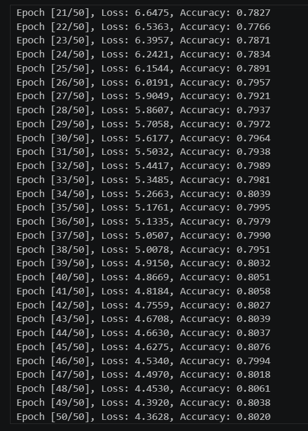
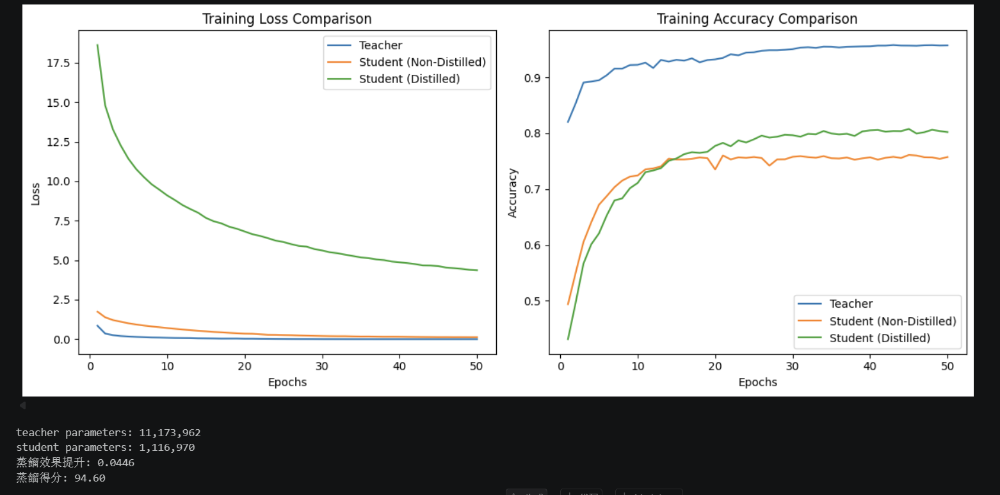

# CIFAR-10 Knowledge Distillation

這是大學「人工智慧實務」課程的知識蒸餾實驗。目標是把大型 teacher 的知識轉移給參數量約十分之一的 student，在不增加推論模型大小的前提下改善 CIFAR-10 準確率。

## 實驗結果

| 模型 | 參數量 | CIFAR-10 準確率 |
| --- | ---: | ---: |
| Teacher | 11,173,962 | **95.71%** |
| Student（未蒸餾） | 1,116,970 | **75.74%** |
| Student（知識蒸餾） | 1,116,970 | **80.20%** |

知識蒸餾讓 student 提升 **4.46 個百分點**；student 參數量約減少 90%。這些數值來自本倉庫 Notebook 保存的課程實驗輸出，可能因硬體、隨機種子與套件版本而略有差異。

## 方法

- 以較深的卷積網路擔任 teacher，較小的卷積網路擔任 student。
- 先分別訓練 teacher 與未蒸餾 student，建立基準。
- 蒸餾訓練同時使用真實標籤、temperature-scaled soft targets 與空間 attention transfer。
- 以相同 CIFAR-10 測試集比較 teacher、baseline student 與 distilled student。





## 執行方式

```bash
python -m venv .venv
# Windows: .venv\Scripts\activate
pip install -r requirements.txt
jupyter lab notebooks/knowledge_distillation_cifar10.ipynb
```

Notebook 使用 `torchvision.datasets.CIFAR10(..., download=True)` 下載資料。倉庫不包含 CIFAR-10 壓縮檔、解壓資料或約 85 MB 的 teacher checkpoint；執行 Notebook 即可重新訓練。

## 資料與公開注意事項

資料來源、引用方式與公開前檢查請見：

- [CIFAR-10 資料說明](docs/DATA_SOURCES.md)
- [GitHub 公開前檢查](docs/PUBLICATION_CHECKLIST.md)

課程提供的起始架構或說明若不是本人原創，應在將倉庫改為公開前取得教師同意並清楚標示；本準備包只保留最終實驗 Notebook 與本人產生的結果圖。
